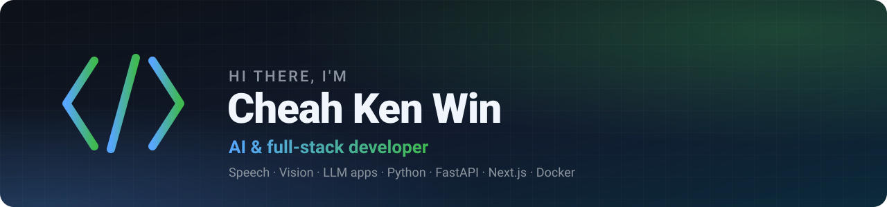

  

  
  

### 👋 About me

I build **AI-powered products end to end**, from GPU inference workers and FastAPI backends to Next.js frontends and chat bots, and ship them to the cloud.

- 🎙️ Currently building a **WhatsApp assistant** that transcribes, summarises, translates, reads PDFs and searches the web
- 🖼️ Built **SuperResAI**, an asynchronous AI image-upscaling platform on GPU workers
- 🧠 Interested in speech, vision and LLM applications that are **fast, cheap and transparent**
- 🐳 I like reproducible setups: Docker, CI and one-command deploys

### 🚀 Featured projects

<table>
  <tr>
    <td width="50%" valign="top">
      <h4>🎙️ <a href="https://github.com/kwincheah/whatsapp_transcript_service">WhatsApp Voice & Document Assistant</a></h4>
      Forward a voice note, video, PDF or question to a WhatsApp bot and get back a transcript, summary, key points, translation, OCR or web answer, with the latency and cost on every reply.
        
      
      
      
      
      
    </td>
    <td width="50%" valign="top">
      <h4>🖼️ <a href="https://github.com/kwincheah/superres-ai">SuperResAI</a></h4>
      Upload a low-resolution image and get an AI-upscaled version: jobs are queued to a Real-ESRGAN GPU worker on Modal, tracked in Supabase and shown with a before/after comparison.
        
      
      
      
      
      
    </td>
  </tr>
  <tr>
    <td width="50%" valign="top">
      <h4>🏗️ <a href="https://github.com/kwincheah/ConstructionLandingPage">BuildIt Construction: landing page</a></h4>
      A responsive marketing site for a construction company, with services, a projects gallery, a contact form and a light/dark theme.
        
      
      
      
      
    </td>
    <td width="50%" valign="top">
      <h4>🐳 <a href="https://github.com/kwincheah/TFContainerDockerCodebase">TensorFlow ML container</a></h4>
      A ready-to-train Ubuntu + Python + TensorFlow image with NumPy, Pandas and scikit-learn, published to GHCR by a GitHub Actions workflow.
        
      
      
      
    </td>
  </tr>
</table>

### 🛠️ Tech stack

**Languages** 

**AI / ML** 

**Backend & frontend** 

**Cloud & DevOps** 

### 📊 GitHub stats

  
  

### 📫 Get in touch

Open an issue or start a discussion on any of my repos. I'm happy to talk about AI apps, speech and vision pipelines, or shipping side projects.

⭐ If one of my projects helped you, a star is always appreciated.

